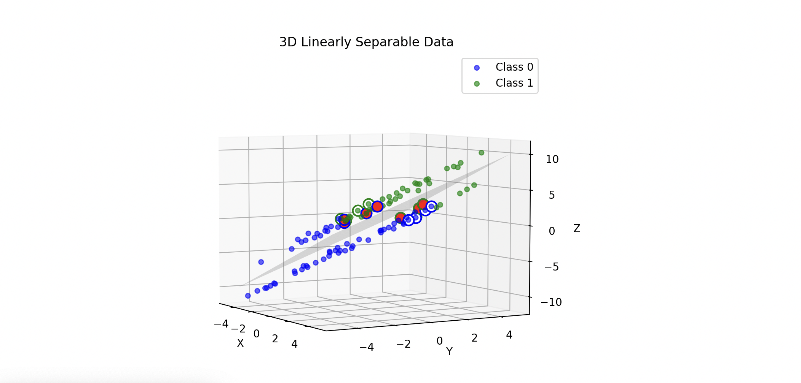

# Coding Challenge Overview

The following code assignments are designed to evaluate contributions to a novel codebase, and
to provide a indication of the type of work one might expect to encounter in a role at
Safe Intelligence. This challenge provides an introduction to formal verification and adversarial
attacks with a simple Projected Gradient Descent (PGD) attack.

This initial assessment is designed to take approximately an hour to complete. If you find yourself
spending significantly more time than that, or run into any unexpected issues running the original
code, please reach out to us. We encourage you to focus on code quality over quantity, and to submit
your work even if you are unable to complete all the tasks.

[](./assets/3d-plot.png)

The provided codebase includes:

- A dataset containing 3D Linearly separable data points.
- A simple data visualization of the dataset.
- A simple neural network model trained on the dataset.
- Adversarial attack using the Projected Gradient Descent (PGD) method.

A graph is generated to visualize:

- The data points in 3D space.
- The class plane separating the data point classes.
- The predictions of the neural network model (blue: 0, green: 1).
- Adversarial inputs (red) generated using the PGD attack.

## Instructions

1. Write a test for the `is_a_counterexample` function in `./provided/pgd.py` that verifies that the
function correctly identifies adversarial examples.

2. The PGD attack uses multiple gradient ascent steps to find an adversarial example. The current 
implementation uses $x$ as the initial adversarial example. Modify the `perturb` function in 
`./provided/pgd.py` to accept an optional parameter `random_start`. If set to `True`, initialise 
$x_{adv}$ as a random point in the vicinity of $x$ sampled from the uniform distribution:

$$
x_{adv} = x + n, \quad n \sim U(-\epsilon, \epsilon)
$$

3. Calculate the robust accuracy of the model for class 1 (green) when attacked with a PGD attack 
with $\epsilon = 0.3$ (5 steps) using the `PGDAttack` class, and with `random_start=False`. This can
be implemented as a new module or within the `main.py` file.

Please document your code in the `REVIEW.md` file, including:

- Brief detail of any changes you made.
- Your approach to solving the problem.
- Any additional improvements you would make if given more time.

### Robust Accuracy

For a binary classification problem, the following metric can be used to evaluate the 
**robust accuracy** of a model:

$$
A_{R}(M, X, \epsilon) = \frac{|TP_{R}| + |TN_{R}|}{|P| + |N|}
$$

where for a model $M$ when attacked with a PGD attack with epsilon $\epsilon$, $TP_{R}$ is the set 
of true __and__ robust positives that are correctly classified, $TN_{R}$ is the set of true __and__ 
robust negatives that are correctly classified, $P$ is the set of positive examples, and $N$ is the 
set of negative examples. Robust here means that the example is correctly classified by the model 
when attacked with a PGD attack with $\epsilon$.

### PGD Attack Algorithm

Projected Gradient Descent (PGD) is a method used to generate inputs that cause a neural network to 
make incorrect predictions. While training a machine learning model, gradients of the loss are 
back-propagated to update weights. PGD leverages this by perturbing the input in the direction 
(+ or -) that maximizes the loss, iterating through steps until the perturbation is within a 
predefined epsilon limit or until it finds an adversarial example that leads to a wrong prediction.

## Setup Requirements

1. Ensure Poetry is installed on your system. Refer to the [Poetry installation guide](https://python-poetry.org/docs/#installation) if needed.
   
2. Activate the virtual environment managed by Poetry by running:
   
```bash
poetry shell
```

3. Install dependencies:

```bash
poetry install
```

4. Generate data:

```bash
poetry run python -m provided.data --verbose
```

5. Run the code:

```bash
poetry run python ./main.py
```

## Related Content

- [Adversarial Robustness](https://www.youtube.com/watch?v=wIX00bZ173k)


